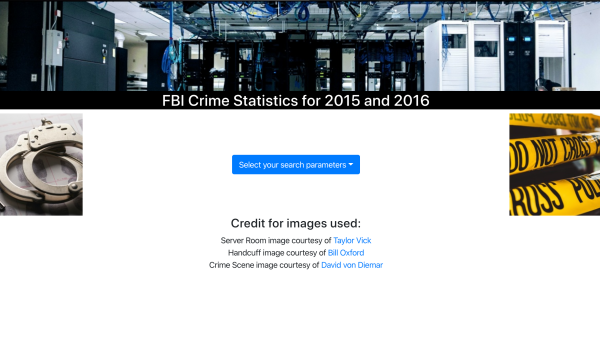
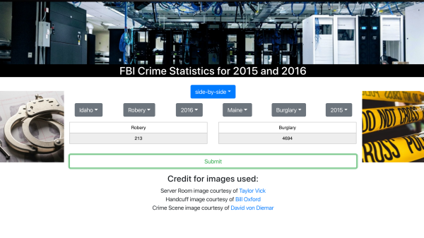
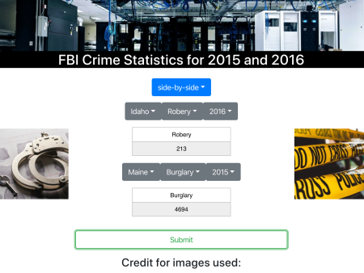
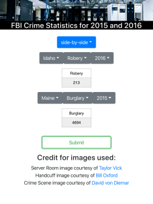
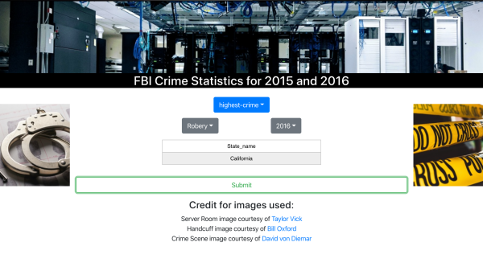

<h1 align="center">Front-end interface for mySQL database application</h1>

    <b>Desktop version of the site with before user selection of query type</b>
     
    

This is the frontend for the full stack mySQL application I built for the Databases CSCI-440 class at Montana State University. The server was hosted on [Digital Ocean](https://www.digitalocean.com/) using CentOS 7.6, mySQL and Node.js for the backend. [View the backend repository](https://github.com/TimParrish/mySQL-REST-API) to see how the API endpoints are structured. The dataset used for this full-stack application was the [FBI Crime Statistics for 2015 and 2016](https://ucr.fbi.gov/crime-in-the-u.s/2016/crime-in-the-u.s.-2016/tables/table-2/table-2.xls#overview) with some expanded random data to meet the parameters of the assignment. 

This frontend interface for the application is mobile responsive through the use of media queries and the styled-components node package (see below for screenshots of desktop/tablet/mobile displays). The interface allows for simple user selectable dropdowns that will generate the HTTP request and recieve a JSON response from the RESTful API. 

### Overview of the frontend technologies used to create the application:

* [React](https://reactjs.org/)
* [Axios](https://www.npmjs.com/package/axios)
* [Styled-components](https://www.npmjs.com/package/styled-components)
* [React JSON to Table](https://www.npmjs.com/package/react-json-table)
* [GitHub Pages](https://www.npmjs.com/package/gh-pages) for deployment of frontend
* [ReactStrap](https://reactstrap.github.io/) for the dropdowns and submit button

### Overview of the backend technologies used to create the application:

[View the backend repository](https://github.com/TimParrish/mySQL-REST-API)

* [NodeJS](https://nodejs.org/en/)
* [Express](https://www.npmjs.com/package/express)
* [mySQL](https://www.npmjs.com/package/mysql)
* [Morgan](https://www.npmjs.com/package/morgan)

    <b>Desktop version of the site with a side-by-side comparison of API results</b>
     
    
      
    <b>Tablet version of the site with a side-by-side comparison of API results</b>
     
    
      
    <b>Mobile version of the site with a side-by-side comparison of API results</b>
     
    
      
    <b>Desktop version of the site with the 'high crime' API results</b>
     
    
      

